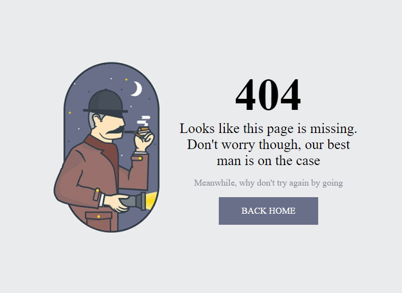

# Serlock-404

 
 

Simple 404 website created with HTML, CSS, for
improving front-end.

Design: https://bit.ly/3Ii3yri

Site published at https://mantodinas.github.io/Sherlock-404/

Created by Mantas Petrauskas 
more projects https://github.com/mantodinas

